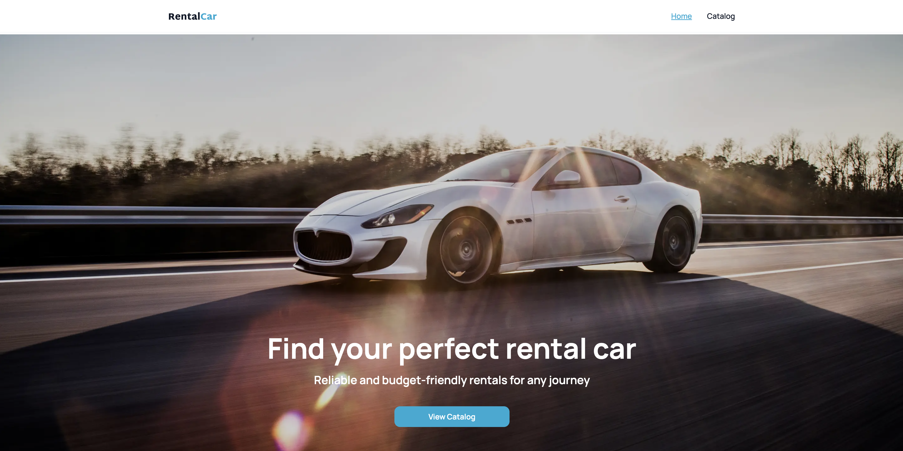
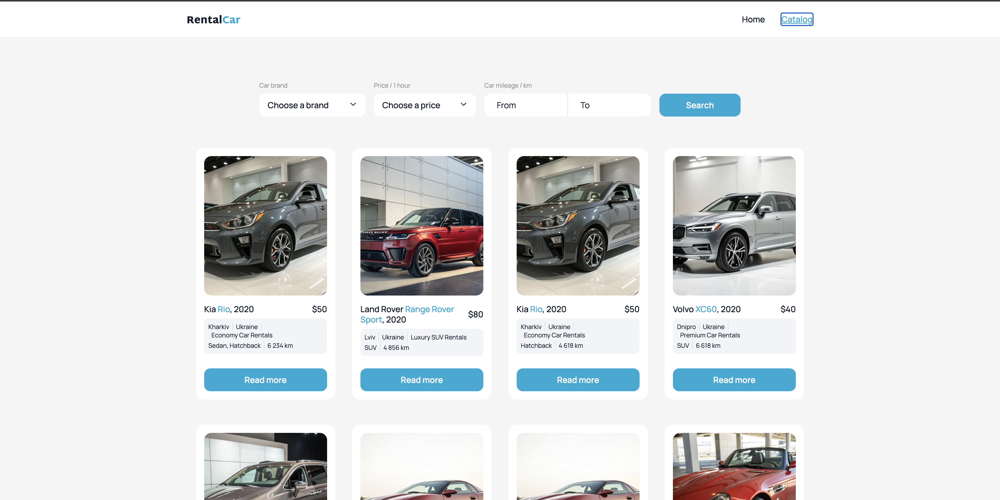
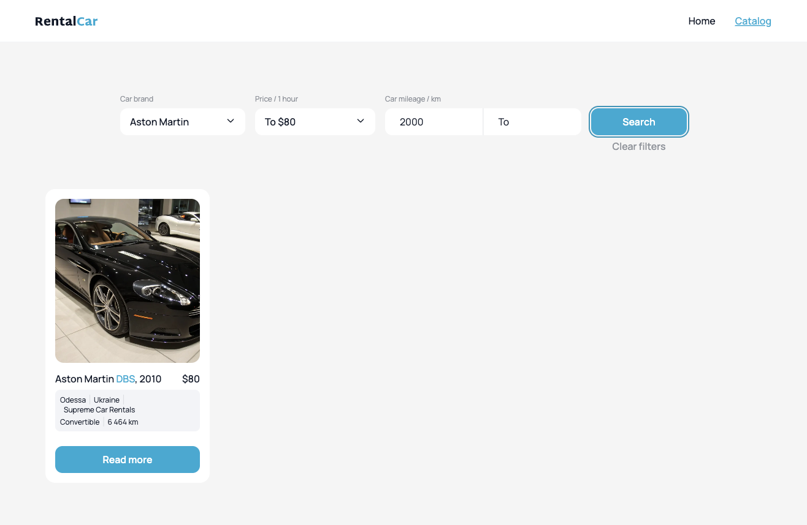

🇺🇦 [Українська][ua] | 🇬🇧 [English][en]


# 🚗 RentalCar (EN)
[en]: #🚗-rentalcar-en

A car rental catalog app — a test task built as part of the GoIT fullstack program. The app lets users browse a list of cars with filters, view car details, and fill out a booking form.

## 🎨 UI/UX Design

**Home page**



**Catalog with filters**



**Filtering example**


**Car details + booking form**



## 🔗 Demo

- Live: `https://rental-car-app-mu.vercel.app/`
- Repository: `https://github.com/Gilona-itsme/rental_car_app`

## 🛠 Tech Stack

- **Next.js** (App Router)
- **TypeScript**
- **TanStack Query** (`useInfiniteQuery`, `useQuery`, `prefetchQuery`)
- **Zustand** (with `persist` for the booking form)
- **Tailwind CSS** — custom component classes
- **Headless UI** — custom `Listbox` dropdowns replacing native `<select>`

## ✨ Features

- Car catalog with **infinite scroll** and a "Load More" button (12 cards per page)
- Custom dropdown filters built with Headless UI
- Loading and empty states as reusable client-side components
- Full-viewport loading overlay scoped to the car list area
- Car details page with `generateMetadata` for SEO and `useParams` + `useQuery` for client-side data
- Booking form built with Zustand, field-level validation, and persisted state (`persist`)
- `FormField` component with a floating label and error states

## 📁 Project Structure (key parts)

```
components/
  CarItem/
  CarList/
  FormField/
app/
  cars/
    page.tsx        # CarsPage — server render + prefetch
    CarsClient.tsx   # client logic with useInfiniteQuery
  cars/[id]/
    page.tsx        # generateMetadata
    CarDetailsClient.tsx
store/
  bookingForm.ts     # Zustand store with persist
```

## 🔌 API

Data is fetched from the GoIT backend: `https://ac.goit.global`.

`Car` types were aligned with the real API response shape:

| Field | Type |
|---|---|
| `engine` | `string` |
| `features` | `string[]` |
| `location` | `{ country: string; city: string; address: string }` |
| `rentalPrice` | `string` |

## 🚀 Getting Started

```bash
git clone <repo-url>
cd rentalcar
npm install
npm run dev
```

The app will be available at `http://localhost:3000`.

## 🧪 Scripts

```bash
npm run dev      # start dev server
npm run build    # production build
npm run start    # run production build
npm run lint     # run ESLint
```

## 🐛 Notable Bugs & Fixes

- Fixed an error caused by `generateMetadata` declared inside a component body
- Fixed `CarDetailsClient` not receiving data
- Added `try/catch` around `prefetchQuery`
- Resolved a hydration mismatch caused by `toLocaleString()` without an explicit locale
- Configured `next/image` for the external image hostname
- Fixed a double slash in the OG image URL
- Resolved `TS2503` caused by incorrect type namespace syntax
- Synced the `queryKey` between `prefetchQuery` and `useQuery`

## 👤 Author

Ilona — Frontend Developer / Web Designer

# 🚗 RentalCar (UA)
[ua]: #🚗-rentalcar-ua

Каталог автомобілів для оренди — тестове завдання, виконане в межах фултстек-курсу GoIT. Застосунок дозволяє переглядати список авто з фільтрами, деталями кожної машини та формою бронювання.

## 🎨 UI/UX дизайн

**Головна сторінка**


**Каталог з фільтрами**


**Приклад фільтрації**


**Сторінка авто + форма бронювання**


## 🔗 Демо

- Live: `https://rental-car-app-mu.vercel.app/`
- Репозиторій: `https://github.com/Gilona-itsme/rental_car_app`

## 🛠 Технології

- **Next.js** (App Router)
- **TypeScript**
- **TanStack Query** (`useInfiniteQuery`, `useQuery`, `prefetchQuery`)
- **Zustand** (з `persist` для форми бронювання)
- **Tailwind CSS** — кастомні компонентні класи
- **Headless UI** — кастомні `Listbox`-дропдауни замість нативних `<select>`

## ✨ Функціонал

- Каталог авто з **infinite scroll** та кнопкою «Load More» (по 12 карток за раз)
- Кастомні дропдаун-фільтри на базі Headless UI
- Стани завантаження та порожнього результату як перевикористовувані клієнтські компоненти
- Повноекранний оверлей завантаження, обмежений областю списку авто
- Сторінка деталей авто з `generateMetadata` для SEO та `useParams` + `useQuery` для клієнтських даних
- Форма бронювання на Zustand з валідацією полів та збереженням стану (`persist`)
- Компонент `FormField` із плаваючим лейблом та станами помилок

## 📁 Структура проєкту (ключове)

```
components/
  CarItem/
  CarList/
  FormField/
app/
  cars/
    page.tsx        # CarsPage — серверний рендер + prefetch
    CarsClient.tsx   # клієнтська логіка з useInfiniteQuery
  cars/[id]/
    page.tsx        # generateMetadata
    CarDetailsClient.tsx
store/
  bookingForm.ts     # Zustand store з persist
```

## 🔌 API

Дані отримуються з бекенду GoIT: `https://ac.goit.global`.

Типи `Car` узгоджені з реальною структурою відповіді API:

| Поле | Тип |
|---|---|
| `engine` | `string` |
| `features` | `string[]` |
| `location` | `{ country: string; city: string; address: string }` |
| `rentalPrice` | `string` |

## 🚀 Встановлення та запуск

```bash
git clone <repo-url>
cd rentalcar
npm install
npm run dev
```

Застосунок буде доступний за адресою `http://localhost:3000`.

## 🧪 Скрипти

```bash
npm run dev      # запуск у режимі розробки
npm run build    # продакшн-збірка
npm run start    # запуск продакшн-збірки
npm run lint     # перевірка ESLint
```

## 🐛 Технічні виклики та рішення

- Виправлено помилку через `generateMetadata`, оголошений усередині тіла компонента
- Вирішено проблему з тим, що `CarDetailsClient` не отримував дані
- Додано `try/catch` для `prefetchQuery`
- Усунено hydration mismatch через `toLocaleString()` без явної локалі
- Налаштовано `next/image` для зовнішнього хостнейму зображень
- Виправлено подвійний слеш в URL OG-зображення
- Вирішено `TS2503` через неправильний синтаксис простору імен типів
- Синхронізовано `queryKey` між `prefetchQuery` та `useQuery`

## 👤 Автор

Ілона — Frontend Developer / Web Designer

---


